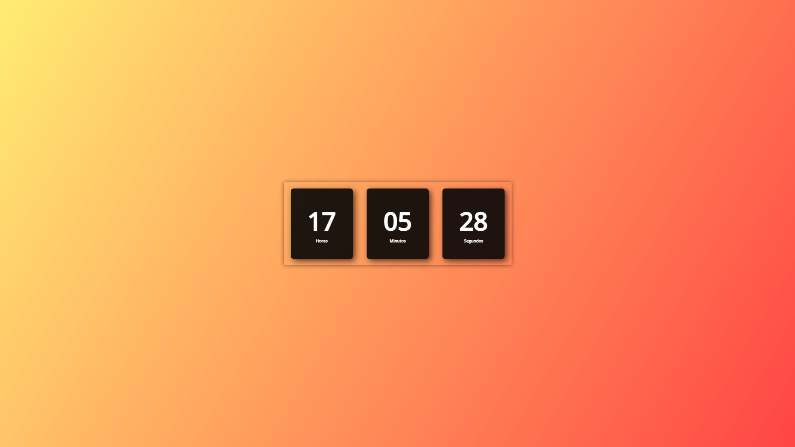

<h1 align="center">
  Relógio Digital
</h1>

  

## 💻 Projeto:

Projeto voltado a estudos, com o objetivo de criar um relógio digital utilizando HTML, CSS e JavaScript.

## 🚀 Tecnologias utilizadas:

- [x] HTML;
- [x] CSS;
- [x] JavaScript.

## 📔 Conhecimentos abordados:

- [x] Uso semântico do HTML;
- [x] Carregamento de video no background;
- [x] Váriaveis do css no `:root`;
- [x] Animações com a biblioteca [AOS](https://michalsnik.github.io/aos/);
- [x] Uso do CSS Flexbox;
- [x] Efeitos com a propriedade `transform` do css.
